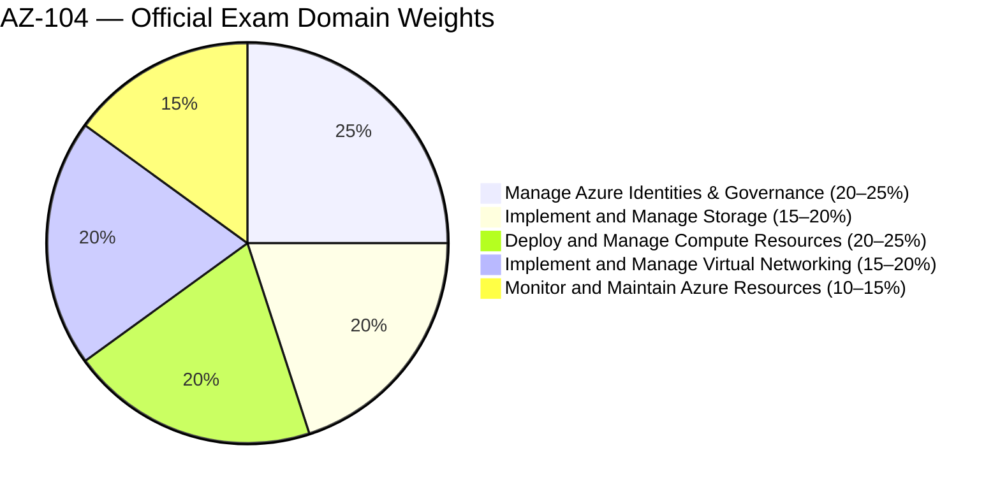
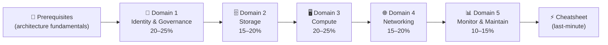

# 📘 AZ-104 Study Notes
{: .no_toc }

**Microsoft Certified: Azure Administrator Associate**
{: .fs-5 .fw-300 }

[Start Studying →](#-exam-overview){: .btn .btn-primary .fs-5 .mb-4 .mb-md-0 .mr-2 }
[View on GitHub](https://github.com/marcogrimaldi29/az-104-study-notes){: .btn .fs-5 .mb-4 .mb-md-0 }

---

> 🏠 These notes are maintained by **[Marco Grimaldi](https://www.linkedin.com/in/marco-grimaldi29/){:target="_blank"}** and based on the **[official Microsoft AZ-104 study guide](https://learn.microsoft.com/en-us/credentials/certifications/resources/study-guides/az-104)** (updated April 2025).
> Find more certification guides, study tips, and tech content at **[🌐 marcogrimaldi29.com](https://marcogrimaldi29.com){:target="_blank"}**.
> *Not affiliated with or endorsed by Microsoft. Always verify against the latest Microsoft documentation.*

---

## 🎯 Exam Overview

| Detail | Value |
|--------|-------|
| 🏅 Certification | **Microsoft Certified: Azure Administrator Associate** |
| 📝 Passing Score | **700 / 1000** |
| 💶 Price (EU) | **~€126** *(varies by country, VAT may apply)* |
| ⏱️ Duration | **~120 minutes** |
| 🔁 Renewal | **Annual** — free online assessment on Microsoft Learn |
| 🛡️ Prerequisite | **None** *(AZ-900 recommended)* |

---

## 📊 Domain Weights

| # | Domain | Weight | Key Focus Areas |
|---|--------|--------|----------------|
| 1 | [Manage Azure Identities & Governance](./01-identity-governance/) | **20–25%** | Entra ID, RBAC, Azure Policy, Cost Management |
| 2 | [Implement and Manage Storage](./02-storage/) | **15–20%** | Storage Accounts, Blob, Azure Files, SAS, encryption |
| 3 | [Deploy and Manage Compute Resources](./03-compute/) | **20–25%** | VMs, VMSS, App Service, Containers, ARM/Bicep |
| 4 | [Implement and Manage Virtual Networking](./04-virtual-networking/) | **15–20%** | VNets, NSGs, Bastion, DNS, Load Balancer |
| 5 | [Monitor and Maintain Azure Resources](./05-monitor-maintain/) | **10–15%** | Azure Monitor, Log Analytics, Backup, Site Recovery |

---

## 🗂️ Notes Index

### 📘 Prerequisites — Azure Fundamentals

Core Azure architecture you must know cold before exam day: global infrastructure, ARM model, resource hierarchy, networking basics, identity concepts, and SLA math.

[Read →](./00-azure-prerequisites/){: .btn .btn-outline }

---

### 🔐 Domain 1 — Identity & Governance

**20–25%** of exam. Microsoft Entra ID, user and group management, RBAC roles and scopes, Azure Policy, resource locks, tagging, subscriptions, management groups, and Azure Cost Management.

[Read →](./01-identity-governance/){: .btn .btn-outline }

---

### 🗄️ Domain 2 — Storage

**15–20%** of exam. Storage account types and redundancy options, Blob storage tiers and lifecycle, Azure Files and SMB/NFS, SAS tokens, access keys, stored policies, identity-based access, AzCopy, and Storage Explorer.

[Read →](./02-storage/){: .btn .btn-outline }

---

### 🖥️ Domain 3 — Compute

**20–25%** of exam. ARM templates and Bicep, virtual machines and disks, availability sets and zones, VM Scale Sets, Azure Container Instances, Azure Container Apps, Container Registry, and Azure App Service including slots, TLS, and custom domains.

[Read →](./03-compute/){: .btn .btn-outline }

---

### 🌐 Domain 4 — Virtual Networking

**15–20%** of exam. VNet design, subnets and peering, NSGs and ASGs, route tables, Azure Bastion, service and private endpoints, Azure DNS (public and private zones), Azure Load Balancer, and Application Gateway basics.

[Read →](./04-virtual-networking/){: .btn .btn-outline }

---

### 📊 Domain 5 — Monitor & Maintain

**10–15%** of exam. Azure Monitor metrics and logs, Log Analytics workspaces, KQL queries, alert rules, action groups, VM Insights, Network Watcher, Azure Backup, Recovery Services vaults, and Azure Site Recovery.

[Read →](./05-monitor-maintain/){: .btn .btn-outline }

---

### ⚡ Quick Reference Cheatsheet

Key numbers, SLA tables, decision trees, CLI/PowerShell command reference, SKU comparison tables, exam traps by domain, and a pre-exam checklist.

[Read →](./06-quick-reference-cheatsheet/){: .btn .btn-outline }

---

## 🧠 How to Use These Notes

These notes follow the **official AZ-104 study guide** domain order. Recommended reading flow:

### 💡 Study Tips

- 🎯 The exam tests **hands-on skills** — use the Azure portal, PowerShell, and CLI regularly
- ⚠️ Each section has **`Exam Caveats`** callouts — these are high-frequency exam traps
- 🔄 Each domain ends with a **quick-reference scenario table** for final review
- 💶 Know **SKU tier feature gates** — Premium vs Standard differences decide many answers
- 📊 **SLA uptime percentages** appear in scenario maths — the cheatsheet has a full table

---

## 📄 Official Resources

| Resource | Link |
|----------|------|
| 🎓 Microsoft Certification Path | [AZ-104 Certification](https://learn.microsoft.com/en-us/credentials/certifications/azure-administrator/) |
| 📋 Skills Measured Guide | [Official Study Guide](https://learn.microsoft.com/en-us/credentials/certifications/resources/study-guides/az-104) |
| 🧪 Free Practice Assessment | [Practice Test](https://learn.microsoft.com/en-us/credentials/certifications/exams/az-104/practice/assessment?assessment-type=practice&assessmentId=21) |
| 🎬 Exam Readiness Videos | [Exam Readiness Zone](https://learn.microsoft.com/en-us/shows/exam-readiness-zone/?terms=az-104) |
| 🏗️ Azure Documentation | [Azure Docs](https://learn.microsoft.com/en-us/azure/?product=popular) |
| 💶 EU Exam Booking | [Pearson VUE Microsoft](https://home.pearsonvue.com/microsoft) |

---

## 📚 About the Study Notes

These notes are hosted on **GitHub Pages** and published as a searchable website on this URL:

👉 **[📘 AZ-104 Study Notes](https://marcogrimaldi29.com/az-104-study-notes/)**

The site includes full-text search, Mermaid diagram rendering, and mobile-friendly navigation for on-the-go review. 

These notes are designed to be a structured, exam-focused summary of the most important concepts and services baseds on the official **[Microsoft AZ-104 Study Guide](https://learn.microsoft.com/en-us/credentials/certifications/resources/study-guides/az-104){:target="_blank"}** and its criteria.

Additional resources and study notes maintained by me, such as the **[📘 AZ-305 Study Notes](https://marcogrimaldi29.com/az-305-study-notes/){:target="_blank"}** and more, are also available for those pursuing the Microsoft and Azure certifications at the following Landing Page:

👉 **[🧑‍🏫 Microsoft Study Notes: Central Hub](https://marcogrimaldi29.com/microsoft-study-notes/){:target="_blank"}**

---

## ✍️ About the Author

These notes are maintained by **[Marco Grimaldi](https://www.linkedin.com/in/marco-grimaldi29/){:target="_blank"}** — Cloud Consultant, Language Trainer & Lifelong Learner.

📍 **Find more content at [🌐 marcogrimaldi29.com](https://marcogrimaldi29.com){:target="_blank"}**

> The website is continuously updated and based on my personal study notes and experiences. If you have any feedback, suggestions, or corrections, feel free to [reach out](https://marcogrimaldi29.com/contact/){:target="_blank"}!

---

## 📈 Analytics

This site uses [Umami](https://umami.is/) for privacy-friendly analytics.

---

## ©️ Credits & Acknowledgements

The [Just the Docs](https://github.com/just-the-docs/just-the-docs) theme is used for a clean, documentation-style layout. Licensed under [MIT](https://opensource.org/license/MIT).

Created with the help of AI. Model used: [Claude Sonnet 4.6](https://www.anthropic.com/news/claude-sonnet-4-6). The content has been reviewed and edited by the author for accuracy and clarity, but may contain errors. Always verify against the latest [Microsoft documentation](https://learn.microsoft.com/en-us/azure/).

---

> *Not affiliated with or endorsed by Microsoft.*